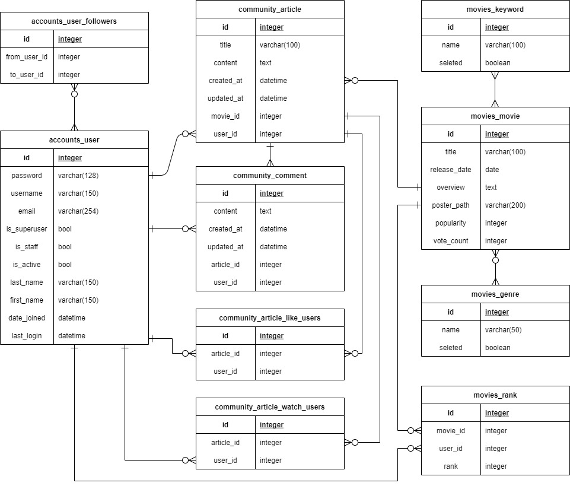
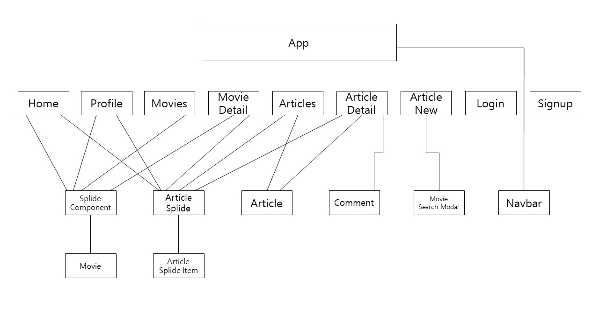

# README

# 1. 팀원 정보

## ㅇㅇㅇ

- 데이터베이스 ERD 작성
- Server 기본기능 구현
- 관리자 페이지 커스텀
- Back 배포 - aws

## 우만승

- URL 목록 작성
- Client 기본기능 구현
- 웹 사이트 디자인
- Front 배포 - netlify
- back, front 네임서버 연결

# 2. 목표 서비스 및 실제 구현 정도

## 목표 서비스

- 영화와 관한 글을 올리며 사용자들끼리 소통할 수 있는 SNS
- 매일 달라지는 키워드에 따라 영화를 추천
- 사용자들이 많은 글을 올리게 유도

## 실제 구현

- 사용자들이 단순한 영화리뷰가 아닌 영화와 관련된 다양한 주제의 이야기를 할 수 있는 공간을 제공
- 관리자가 선택한 키워드, 장르에 따라 영화를 추천하여 제공
- 사용자에게 영화뿐만 아니라 사용자가 좋아할 게시글을 추천하여 커뮤니티가 활성화되게 유도

# 3. 모델링

### 데이터베이스 모델링

### 컴포넌트 구조

# 4. 필수 기능

## 관리자 뷰

- django에서 제공하는 admin페이지를 이용하여 구현

## 영화 정보

- TMDB API를 활용하여 영화 데이터 80개 수집
- 로그인 된 유저는 영화에 대한 평점을 등록 및 수정 가능

## 추천 시스템

### 1) 개인

- 유저가 평점을 등록한 영화들의 키워드, 장르 데이터를 이용하여 추천 영화들을 제공
- 추천 영화들을 주제로 한 게시글을 제공

### 2) 공통

- 관리자 페이지에서 키워드, 장르를 선택
- 관리자가 선택한 키워드, 장르를 기반으로 추천 영화들을 제공
- 추천 영화들을 주제로 한 게시글을 제공

### 3) 추천 알고리즘

1. 키워드, 장르 목록을 불러온다.
   - 개인: 유저가 평점을 등록한 영화들의 키워드, 장르 목록
   - 공통: 관리자가 관리자 페이지에서 선택한 키워드, 장르 목록
2. 전체 영화 데이터에서 1번에서 불러온 키워드, 장르를 포함하고 있는 개수를 각각annotate한다.
3. 키워드, 장르 둘 중 하나라도 포함하고 있는 개수가 1이상인 영화들을 filtering한다.
4. filtering한 영화데이터를 2번에서 annotate한 개수의 오름차순으로 정렬하여 제공한다.

## 커뮤니티

- 로그인한 사용자만 글을 조회, 생성 가능
- 글 작성시, 영화를 선택하고 영화와 관련된 글을 작성
- 게시글의 작성자만 해당 게시글 삭제 가능
- 게시글 좋아요, 작성자 팔로우 가능
- 댓글 작성, 수정, 삭제

# 5. 배포 서버 URL

### **Server**

> /api/v1/

1. movies app

   - /movies/(GET): 영화목록 데이터를 응답(제목, 포스터주소, 평점)

   - /movies/release-date/(GET): 최근 한달동안 개봉한 영화목록 데이터를 응답
   - /movies/vote-count/(GET): tmdb 평가수가 많은 순으로 영화목록 데이터를 응답
   - /movies/rating/(GET): 평균평점이 높은 순으로 영화목록 데이터를 응답
   - /movies/genre/(GET): 관리자가 선택한 장르 목록 응답
   - /movies/keyword/(GET): 관리자가 선택한 키워드 목록 응답
   - /movies/recommendation/(GET): 관리자가 선택한 키워드, 장르 기반으로 추천 영화 목록을 응답
   - /movies/recommendation-user/(GET): 유저가 평점을 남긴 영화와 비슷한 영화목록을 응답
   - /movies/*movie_id*/(GET): 영화 상세 정보를 응답(전체)
   - /movies/*movie_id*/rank/(GET): 유저가 입력한 영화 평점을 응답
   - /movies/*movie_id*/rank/(POST): 유저가 입력한 영화 평점을 데이터베이스에 기록
   - /movies/*movie_id*/recommendation/(GET): 현재 영화와 장르, 키워드가 비슷한 영화목록을 응답

2. community app

   - /articles/(GET): 글 목록을 응답
   - /articles/(POST): 글 정보를 데이터베이스에 추가
   - /articles/recommendation/(GET): 추천 영화를 주제로 한 글 목록을 응답
   - /articles/recommendation-user/(GET): 유저에게 제공된 추천 영화를 주제로 한 글 목록을 응답
   - /articles/*article_id*/: 글 상세 정보를 응답
   - /articles/*article_id*/(PUT): 데이터베이스의 글 정보를 수정
   - /aritcles/*article_id*/(DELETE): 데이터베이스의 글을 삭제
   - /articles/*article_id*/comments/(POST): 글에 대한 댓글을 데이터베이스에 추가
   - /articles/comments/*comment_id*/(PUT): 데이터베이스에서 댓글 수정
   - /articles/comments/*comment_id*/(DELETE): 데이터베이스에서 댓글 삭제
   - /articles/*article_id*/like/(POST): 로그인한 유저의 글 좋아요/좋아요 취소를 데이터베이스에 기록

3. accounts app
   - /accounts/signup/(POST): 회원가입
   - /accounts/api-token-auth/(POST): JWT 토큰 발급
   - /accounts/api-token-refresh/(POST): JWT 토큰 갱신
   - /accounts/*username*/(GET): 프로필 정보를 응답
   - /accounts/*username*/follow/(POST): 로그인한 유저가 해당 프로필의 유저를 팔로우/언팔로우한 것을 데이터베이스에 기록

### **Client**

1. movies app

   - /movies: 영화목록 페이지

   - /movies/*movie_id*: 영화 상세 정보 페이지

2. community app

   - /articles: 글 목록 페이지
   - /articles/new: 글 작성 페이지
   - /articles/*article_id*: 글 상세 정보 페이지

3. accounts app
   - /accounts/signup: 회원가입
   - /accounts/login: 로그인
   - /accounts/username: 프로필

# 6. 느낀점

**기획**

- 프로젝트를 진행하면서 기획은 최대한 꼼꼼하게 이뤄져야 한다는 것을 느꼈습니다.
  - 기능을 구현하다 보면 기술적으로 부족해서, 혹은 이전 단계에서 기능 구현을 느슨하게 해서 예상치 못하게 기획에서 어긋나는 부분이 생겼는데, 기획을 좀 더 꼼꼼히 했다면 이런 상황들을 덜 발생시키거나, 유연하게 대처가 가능했을 것 같습니다.
- 기획단계에서는 Client와 Server를 나누어 진행하되, 기본 기능 구현 후에는 서로 내용을 공유하면서 Client와 Server 구분 없이 함께 진행하자고 이야기 했었습니다. 하지만 작업속도에 차이가 났고 Server 부분은 거의 참여하지 못했습니다. 오히려 Client 부분만 ㅇㅇ님이 많이 참여하고 도와주셔서 잘 진행할 수 있었습니다.

**기본 기능 구현**

- Vue에 아직 익숙하지 않아 기본 기능을 구현하는 데에만 3-4일 정도가 걸렸습니다. 하지만 그만큼 Vue를 사용하는데에 익숙해질 수 있었고, 서비스 구조가 커지면서 Vuex, Vue Router 플러그인의 유용함을 느낄 수 있었습니다. 모든 데이터를 Store에서 관리하면서 컴포넌트간 위계에 신경쓸일이 적었고, 데이터를 이용해 Client에서 다양한 시도를 할 수 있었습니다.

**디자인**

- 디자인에 익숙하지 않아 다양한 사이트들을 참조했고, flaticon.com에서 로고를 가져왔습니다. 이후 디자인은 최대한 간결하게 하면서, 로고의 색상과 결을 맞추는 방식으로 진행했습니다.
- 단순히 컴포넌트간 간격을 맞추고, 포스터 크기를 하나로 맞추는 데에도 긴 시간이 소모됐습니다. 프로젝트 후반 3-4일 정도는 거의 CSS와 JacaScript만 만졌는데도 CSS는 어렵습니다.. 여전히 갈 길이 멀었고 앞으로도 CSS는 꾸준히 접하고 만져봐야겠다고 생각했습니다.

**추가 기능**

- 별점을 부여할 때 마우스 움직임에 따라 별 내부를 반개씩 채워서 보여주고, 클릭 시 ajax 요청으로 별점을 실시간으로 부여하는 기능을 만드는게 재미있었습니다. 사용할 때는 몰랐는데, 생각보다 JavaScript로 처리해야 할 내용이 많았고, 경우의 수를 따져가며 기능을 구현해서 결과적으로 작동되는 것을 봤을 때 기분이 참 좋았습니다. 다른 기술 블로그에서 CSS를 토글하는 아이디어를 보고 나름대로 만들어 봤는습니다. 그 기술 블로그에서는 컴포넌트 데이터에 다섯 칸짜리 리스트를 만들어 별의 상태를 체크하는 방식을 쓰고 있었습니다. 처음 봤을 때는 코드가 잘 이해되지 않아 다른 방법으로 구현했는데, 기능을 구현하고 나니 컴포넌트 데이터를 설정해서 구현하는게 좀 더 vue를 잘 이용하는 방법이라는 생각이 들었습니다. 그래도 이 과정에서 Javascript에 더 익숙해질 수 있었습니다.

**디버깅, 에러 처리**

- 비동기 요청을 많이 이용하다 보니 팔로우를 토글하거나 영화 데이터를 새로고침하는 등의 과정에서 순서를 많이 생각해야 했습니다. 요청과 응답, 외부 요청과 Vuex store 내부의 로직간의 순서 등을 생각해서 코드를 작성해야 화면에 표시되는 데이터가 서로 완전히 일치할 수 있었습니다. 이후 배포 단계에서는 서버 처리 속도가 로컬보다 느려 또 순서 문제나 일부 기능이 매끄럽게 작동하지 않는 오류가 있었습니다. 프론트엔드를 작성할 때는 비동기 요청에 대한 확신(?)과 순서 관계가 정말 중요하다고 느꼈습니다..
- Vue Router의 스크롤 바가 잘 움직이지 않거나, Splide 라이브러리가 잘 작동하지 않는 등 다양한 문제가 발생했고, 자바스크립트를 이용하고, 공식 문서를 참고하는 등 다양한 방법으로 해결할 수 있었습니다.
- 기본기능 구현 과정에서도 JWT Token을 필요로 하지 않는 요청에서 401 오류가 나는 등 여러가지 오류가 있었습니다. 하지만 ㅇㅇ님과 공식문서, Stackoverflow, 기술블로그 등을 참고해서 해결할 수 있었습니다. 혼자 할 때보다 같이 디버깅 하는게 훨씬 빠르다고 느꼈습니다..👍

**배포**

- AWS에 Server를 배포하는 것은 Deploy 문서를 참고해서 진행했습니다. 중간 과정들을 모두 이해한 것은 아니라서 이후로도 공부가 필요할 것 같습니다.
- Netflify에 Client를 배포했습니다. github repo와 연동하여 배포했고, environment에서 .env.local에 입력하는 로컬 변수를 설정할 수 있었습니다.
- Server와 Client를 따로 이용하기 때문에 각각 https를 이용해야 했고, 따라서 도메인을 구매해야 했습니다. 네임서버에 대한 개념을 하나도 몰라서 처음 구매한 도메인과 각 서버를 연결하는데 힘든 시간을 보냈습니다. 결과적으로 프론트 서버가 먼저 연결되었고, 최대 6개까지 등록할 수 있는 네임서버 중 4개를 사용했고, 해당 url로 접근하면 항상 netlify 서버로 연결돼 백엔드를 위한 도메인을 따로 구매해야만 하는 줄 알았습니다. 그래서 추가로 도메인을 구매했습니다. 알고보니 하나의 도메인으로도 프론트와 백을 모두 사용할 수 있는 방법이 있었습니다. 그래도 가장 싼 도메인을 사용해서 성공한 것 만으로도 기분은 좋았습니다.. 둘다 https 연결로 이용했고, 성공했습니다.

**그 외**

- 처음으로 짧다면 짧고 길다면 긴 1주일 동안 팀으로 프로젝트를 진행했습니다. Server를 담당한 ㅇㅇ님이 데이터를 잘 정리해서 보내주셔서 기본적인 Client 작성은 생각보다는 수월하게 진행할 수 있었습니다. 힘들었던 만큼 많이 배울 수 있었던 프로젝트였습니다..!